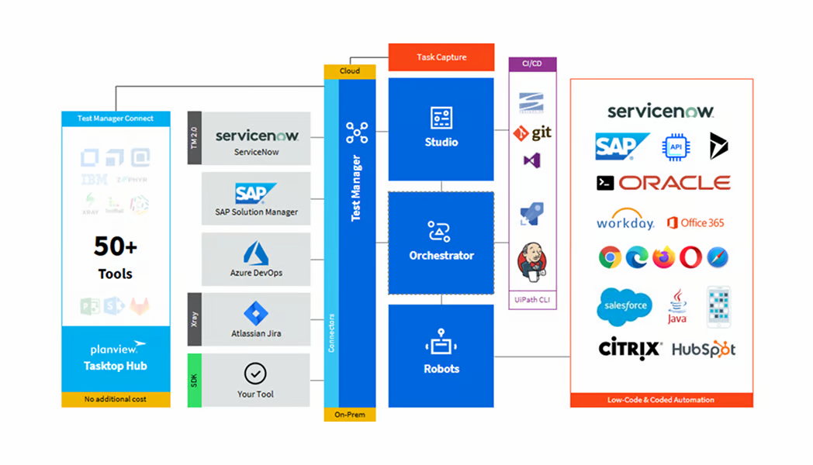

# 1. Getting Started with Test Manager

## What is Test Manager?

**Test Manager** is a web application, part of UiPath Test Cloud, where you can **plan**, **run**, **manage**, and **analyze** testing of applications.

Test Cloud offers a strong automation and testing ecosystem for managing all your testing operations: from **automating tests**, to **distributing** them, **executing**, and **managing** — you can perform all of these things in the context of a customizable cloud organization.

## Why is Test Manager useful?

Testing involves a wide range of activities, from the **creation** and **execution** of manual and automated test cases to reporting, requirement and defect management, CI/CD integration, and others.

One of the biggest challenges is making testing an integral part of the development process. This requires linking software development assets (e.g. user stories, epics, requirements) to software testing assets (e.g. test cases, test results, test executions), as well as a solution to manage and synchronize all the data generated in both processes. Test Manager is the component serving these purposes.

## How does Test Manager work?

## The typical testing flow with Test Manager

1. Requirements are created either in Test Manager (TM) or in an external tool and imported into TM.
2. The tester defines, generates (using Autopilot), or imports test cases in TM, and optionally documents them with Task Capture.
3. The test developer reviews the documentation and automates the defined test cases (from step 2) in Studio.
4. The test developer links the test case (automation) from Studio to the test case (design) in TM.
5. The test developer publishes automated test cases from Studio to Orchestrator.
6. The test developer creates test sets in Test Manager.
7. Test sets are executed — automated and/or manual — from Test Manager.
8. Based on the test execution results, reports are generated. If needed, defects are generated (optional, and only if you link to an external ALM tool).

!!! info "The native Automation Cloud interface"
    Allows you to perform RPA testing.

!!! info "The Test Cloud interface"
    Allows you to perform application testing only.

## Import Project

You can import projects from external sources to conduct testing operations through Test Manager. Use this feature to transfer entire testing projects from different Application Lifecycle Management (ALM) systems into Test Manager.

Importing the project follows a schema that converts external system projects (e.g. testing applications) into a format that Test Manager can read. This includes objects such as requirements, test cases, test sets, test results, labels, custom fields, and attachments. The import process runs asynchronously and must follow the expected format.

!!! example "It's your turn now!"
    Import the following TMH file into your Test Manager instance.

    Modify the **Name** and **Prefix** by adding a suffix with your name — e.g. `UiBank_{your name}` and `UIB{initials}`.

    This is the project you'll be working on for the rest of the day.

    :material-file-download: [**UIB_UiBank_2024_03_01_18_18_46_3481.tmh**](https://articulateusercontent.com/rise/courses/wbarvVGUFeVtnNnsoksCvGVOBH9YzS_J/RjVBhG7OV_uDYf4i-UIB_UiBank_2024_03_01_18_18_46_3481.tmh) (7.2 KB) — project import file for Test Manager

---

[← Overview](index.md) · [Next: Agentic Testing →](02-agentic-testing.md)
