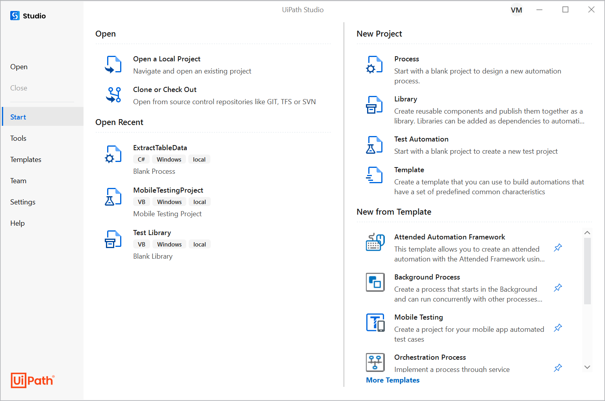

# 3. Getting Started in Studio

## UiPath Studio

Studio provides specialized tools to integrate testing into the development and automation process. Studio allows you to perform both Application and RPA testing. You can use Studio to create, design, and map test cases and execution results to requirements and defects (e.g. Jira, Xray).

## Test Automation Project

For application testing we use a project of type **Test Automation**.

We use the following activity packages:

- `UiPath.System.Activities`
- `UiPath.UIAutomation.Activities`
- `UiPath.Testing.Activities`

## Testing activities

The most important testing activities are the verify (assert) activities:

**Verify Expression**
: Verifies the truth value of a given expression. An expression must be supplied in its respective property field.

**Verify Expression With Operator**
: Verifies an expression by asserting it in relation to a given expression with an operator. The expressions tested with this activity must be inserted in their respective property fields.

**Verify Control Attribute**
: Verifies the output of a given activity by asserting it in relation to a given expression. The activities tested with this activity must be inserted in the body of the activity, and an expression and operator must be supplied in their respective property fields.

**Verify Range**
: Verifies whether an expression is located within a given range. The expressions tested with this activity must be inserted in their respective property fields.

### Properties for verification activities

- **ContinueOnFailure** — Specifies if the automation should continue even when the activity throws an error. Default is `True`. If set to `False` and an error is thrown, execution stops. If `True`, execution continues regardless of any error.
- **TakeScreenshotIfFailed** — If `True`, takes a screenshot of the target process if the verification fails.
- **TakeScreenshotIfSucceded** — If `True`, takes a screenshot of the target process if the verification succeeds.
- **AlternativeVerificationTitle** — Specifies an alternative display name, overriding the default `DisplayName` shown in Orchestrator.
- **OutputMessageFormat** — Specifies the format of the output message.
- **Result** — Reflects the state of the verification activity. Use this to send notifications or create reports for failed verifications.

## Test case

A **test case** is a specification of the input, execution conditions, testing procedure, and expected results that define a single test.

Widely adopted as a best practice for test case design:

=== "GIVEN"
    In the Given part, setup to prepare for the desired testing action is performed.

=== "WHEN"
    In the When part, the workflow to be tested should be invoked, and the data to be compared with the "expected data" should be available.

=== "THEN"
    In the Then part, the expected result should be compared with the actual result, and the "context clean-up" should be done.

---

[← Agentic Testing](02-agentic-testing.md) · [Next: Object Repository →](04-object-repository.md)
