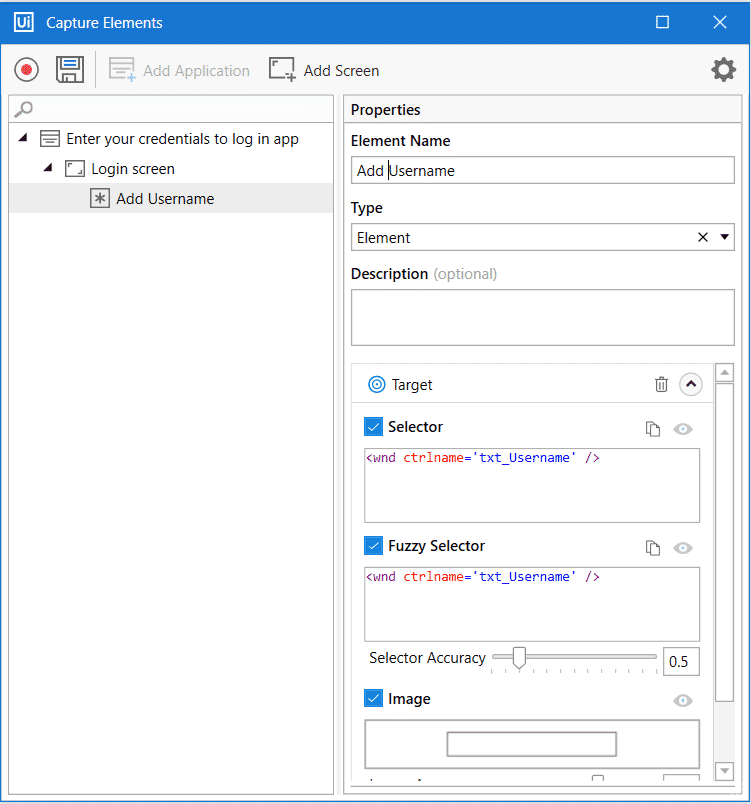
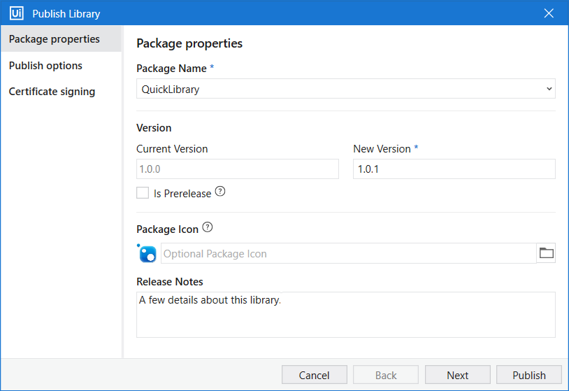

# 4. Object Repository

## What is Object Repository?

The Object Repository is a DOM-like repository system that lets you create, manage, and reuse UI taxonomies inside and across test automation projects. With Object Repository you can build a "UI API" for your application and share it with your team within minutes.

## Benefits of using the Object Repository

- UI elements across the project are managed, updated, and modified from a centralized place.
- Capture the elements you need in your automation with the Capture Elements wizard, increasing selector reliability by capturing elements together with their anchors.
- Automate faster by drag-and-dropping elements from the Object Repository panel.
- Objects are reusable in the local project or across projects when packaged as libraries.
- Upgrade application and process UI elements in one go with UI libraries.

## Object Repository structure

The structure of elements created with the Object Browser follows this hierarchy:

**Application → Version → Screen → UI Element → UI Descriptors**

## Best practices

- **Reusability** — Achieve reusability through local elements, snippets, and UI libraries in the Object Repository.
- **Use descriptive names** — Use meaningful, descriptive names for objects in the repository. Avoid generic names such as "Button1" and "Link2" — they become confusing over time.
- **Organize objects** — Group objects within a repository by screen, type of object (buttons, input fields, etc.), or another logical categorization.
- **Version control** — When publishing a new version of the same UI library, make sure to properly increment the version number in the Publish window.

## Best Practices for Mapping UI Elements

- **Use the Object Repository** — Instead of relying on static selectors, always use the Object Repository for managing UI elements in your test automation.

- **Avoid absolute selectors** — Avoid absolute selectors (e.g., full CSS or idx-based selectors) as they break with UI changes. Use relative or anchor-based selectors for reliability.

- **Use anchor-based selectors** — When dealing with dynamic UI elements, use anchor-based selectors to make your selectors more robust and maintainable.

- **Enable Chromium interaction method** — Enable Chromium or Simulate interaction method for faster execution when interacting with web and desktop apps.

- **Implement retry mechanisms** — Use Retry Scope or On Element Appear to handle intermittent UI delays and make your tests more resilient.

## Manual creation of a repository

You can create your own repository from within the Object Repository panel by defining the application, each screen, and each element manually.

### Hands-on: Creating a UI Library

Let's create a simple UI Library by capturing elements from your application.

#### Steps

- **Start with a library project** — You'll be working with a Test Automation library project that's designed to store reusable UI elements.

- **Click Capture Elements** — In the Object Repository panel, click the "Capture Elements" button to begin capturing UI elements from your application.

- **Click Start Recording** — This activates the capture mode, allowing you to interact with your application and select elements to capture.

- **Click elements to capture** — As you navigate through your application screens, click on the UI elements (buttons, text fields, links, etc.) that you want to capture and store in the repository.

- **Click Save** — Once you've captured all the elements you need, click Save to store them in your UI Library. These elements are now reusable across your test automation projects.

!!! tip "Next: Use your library"
    With your UI Library created, you can now reference these captured elements in your test cases, speeding up automation and ensuring consistency across tests.

### Hands-on: Publishing a UI Library

Once your UI Library is ready with captured elements, publish it to make it available for use across projects.

#### Steps

- **Click Publish** — In the library project, click the "Publish" button to initiate the publishing process.

- **Select Custom from dropdown** — In the publish dialog, select "Custom" from the dropdown menu to specify a custom location for your library.

- **Enter path in Custom URL** — Provide the path or URL where you want to publish the library. This path makes the library accessible to other projects.

- **Click Publish** — Confirm the publication by clicking "Publish" again. Your UI Library is now published and ready to be used in your test automation projects.

!!! tip "Library published"
    Your UI Library is now available for other Test Automation projects to reference and use, enabling team-wide reusability of UI elements.

!!! note "Naming Consistency Tip"
    Ensure that the screen and element names in the Object Repository closely match those used in the Manual Test Case steps.

    For example, if the first screen in the Manual Test Case is named "Loans", the corresponding screen in the Object Repository should also be named "Loans".

    Consistent naming helps the agent correctly map test steps to UI elements.

---

[Next → 05. Test Automation Project](05-test-automation-project.md){: .md-button .md-button--primary}

---
