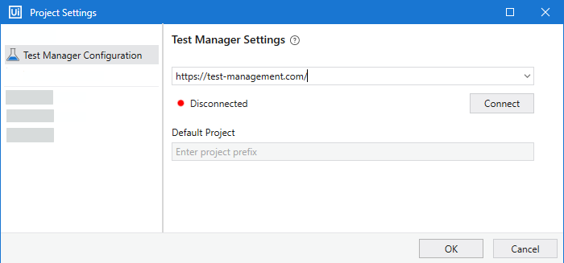
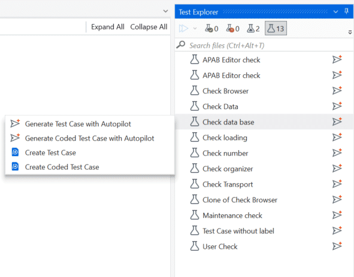

# Connect Your Project to Test Manager and Import the Object Repository

## Launch the downloaded ILT Test Automation project

1. Launch UiPath Studio.
2. Select **Open Local Project**.
3. Browse to the extracted project folder and select the `project.json` file.
4. Click **Open** to load the project.

## Exercise: connect Studio to Test Manager

To complete the integration with Studio, you need to configure the Test Manager settings.

1. In the **Design** ribbon, navigate to **Test Manager → Test Manager Settings**.
2. Go to **Test Manager Configuration** and enter your Test Manager URL from Automation Cloud.
3. Click **Connect** and log in using your Test Manager credentials.
4. Select your default project from the dropdown list in **Default Project**.
5. Click **OK** to save changes. Once connected, this is reflected with a green icon.

Now, you will find the test cases that were part of the exercise, as well as the manual test cases here in Studio in the **Test Explorer**.

## Import the Object Repository library

Next, import the UI Library you published earlier so its elements are available in this project.

1. Click **Manage Packages** from the top ribbon.
2. Go to **Settings**.
3. Provide a unique name for the package source.
4. Click the ellipsis (**...**) button and browse to the custom location where the library was saved. Select the library and click **Add**.

✅ The custom library now appears in the left panel alongside the other defined sources.

✅ Select the library, click **Install**, then click **Save**.

---

[Next → Manual to Automated Test Case](07-manual-to-automated-test-case.md){: .md-button .md-button--primary}

---

