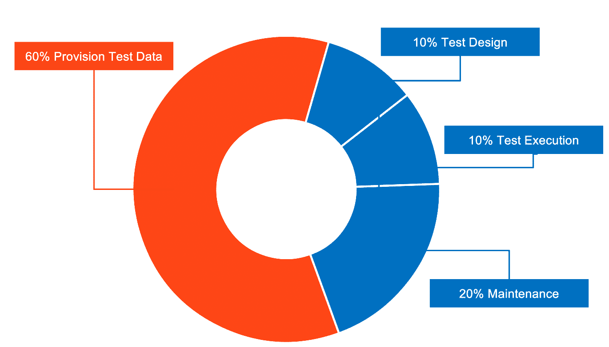

# Data-Driven Testing and Test Data Management

## Introduction to data-driven testing

**Learning objectives**  by the end of this chapter, you will be able to:

1. Understand data-driven testing.
2. Manage test data.
3. Compare the six different data source options available in UiPath:
    - File (Excel/JSON)
    - Generate with Autopilot (AI-powered)
    - Data Service (Automation Cloud)
    - Existing Data (project-based)
    - Test Data Queue (JSON schemas)
    - Auto Generate (path coverage)
4. Generate synthetic test data:
    - Using Activities
    - Using Autopilot to generate contextually relevant test data
5. Create data-driven test cases using multiple data sources.
6. Apply best practices for test data management.

Data-driven testing lets you execute a single test case multiple times with different input datasets, instead of creating a separate test case for every scenario.

✅ Test multiple scenarios efficiently

✅ Separate test logic from test data

✅ Easily add new test variations

✅ Achieve better test coverage

!!! note "Prerequisites"
    Orchestrator 2022.4 or later is required to use data-driven testing functionality.

## Test data management

Test data management covers three main steps:

✅ **Designing** the appropriate data for each test scenario

✅ **Provisioning** that data into the environment where tests will run

✅ **Consuming** the data during test execution

This process can consume up to 50% of testing effort. Test data management presents the following challenges:

  

    

      
Manual complexity

      
Preparing datasets by hand is time-consuming and error-prone.

    

  

  

    

      
Specialized knowledge

      
Creating realistic, valid data often requires domain expertise.

    

  

  

    

      
Frequent refreshes

      
Data needs to be updated regularly to stay relevant as systems change.

    

  

  

    

      
Coverage gaps

      
Incorrect or incomplete data can lead to scenarios going untested.

    

  

### Data creation approaches

Three primary strategies exist for creating test data:

  

    

      
Production data

      

        
Use copy of existing production database

        <ul>
          <li>GDPR</li>
          <li>Low coverage</li>
          <li>Outdated</li>
        </ul>
      

    

  

  

    

      
Anonymized production data

      

        
Use anonymized copy of production database

        <ul>
          <li>Complex customization</li>
          <li>Expensive</li>
        </ul>
      

    

  

  

    

      
Synthetic data

      

        
Generate data that mimics production

        <ul>
          <li>High coverage</li>
          <li>Reduced privacy risk</li>
          <li>Easy reproduction</li>
        </ul>
      

    

  

## The six data source options

✅ **File** (Excel/JSON) for prepared data

✅ **Generate with Autopilot** using AI capabilities

✅ **Data Service** for consolidated cloud-based management

✅ **Existing Data** from project folders

✅ **Test Data Queue** using JSON schemas

✅ **Auto Generate** for path coverage optimization

## Generating synthetic test data

### Using activities

UiPath provides activities that generate synthetic values directly in a workflow, including Address, Given/Last Names, Random Dates, Numbers, Strings, and custom Values.

### Using Autopilot

Autopilot supports natural language prompts to generate contextually relevant test data for supported argument types, including `String`, `Int32`, `Int64`, `Double`, `Decimal`, and `Boolean`.

!!! example "Exercise 1: Synthetic test data creation using Test Data Activities"
    1. Create approximately 10 records of synthetic test data matching the UiBank Loans application structure.
    2. Store the generated data in an Excel file within the same folder.
    3. **Optional extension:** generate 100 records following the same requirements structure.

    !!! note ""
        The Address activity returns a Dictionary with key-value pairs (`Country`, `PostalCode`, `StreetNumber`, `StreetName`, `City`, `State`) accessible via bracket notation.

!!! example "Exercise 2: Generate test data by giving instructions in natural language"
    1. Create a new test case containing three arguments: `CountryName`, `CityName`, and `IBAN`.
    2. Access Autopilot and enter this prompt: *"Generate a list of 20 European countries with names typical to the country, cities from the country, and IBANs in the country's format."*
    3. Review and import the generated test data.

## Auto Generate for path coverage

Auto Generate uses symbolic execution to intelligently create data variations that cover execution paths. It supports numeric, Boolean, and String types, as well as arrays.

!!! example "Exercise 6: Generate a test case using Auto Generate"
    1. Locate **Test Case - Generate Loan Quotes.xaml** in the **3. Test Data Management > AI Generated** folder and review its arguments.
    2. Right-click the workflow and select **Create Test Case**.
    3. Enter a unique test case name and proceed to the Test Data configuration.
    4. In the Import Data Variation Source wizard, select **Auto Generate** from the Source dropdown.
    5. Wait for and review the generated test data variations.
    6. Execute the completed test case via Test Explorer and review all variations.

## Data Service

Data Service (transitioning to the Data Fabric naming) enables centralized entity management, collaboration, and data variation updates without republishing test cases.

!!! example "Exercise 5: Create a data-driven test case using Data Service"
    **Step 1: Create Data Service entities**

    1. Modify the `UiBankLoanDataSchema.json` file by adding a name suffix.
    2. Import the schema to Data Service.
    3. Add two records with different values.
    4. Import data from `UiBankLoanData.csv`.

    **Step 2: Create a test case using Data Service**

    1. Create a new data-driven test case for the UiBank create loan flow.
    2. Link it to the `UiBankLoanData` entity.
    3. Map workflow arguments to the Data Service entity.
    4. Add a Verify activity to compare actual versus expected rate.
    5. Execute the test case and observe the data variations.

## Creating data-driven test cases

!!! example "Exercise 3: Create a data-driven test case using Excel"
    1. Navigate to an existing test case.
    2. Right-click and select **Add Test Data**.
    3. Choose the Excel or JSON file containing your input data.
    4. Use the Excel file created in the synthetic data exercise above.

!!! example "Exercise 4: Create a data-driven test case using Autopilot"
    1. Generate 25 test data points for **Generate Loan Quotes.xaml**.
    2. Provide specific instructions addressing edge cases in your prompt.
    3. Import the refined results into your test case.

---

[Next → Orchestrator](09-orchestrator.md){: .md-button .md-button--primary}

---
