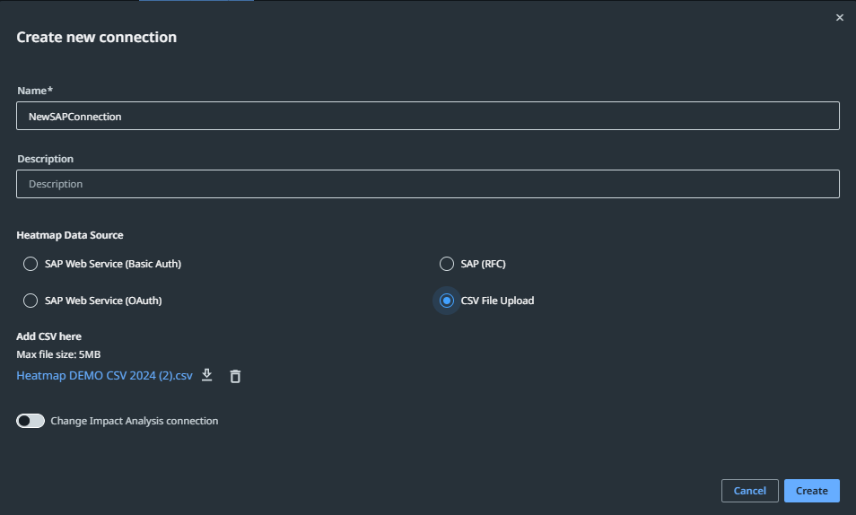

# 12. Building Your Own AI Agents

## Comparing agents with robots

**Agents** are goal-based, act independently, and make dynamic decisions. They're best suited for ad hoc tasks requiring high adaptability — the next evolution in test automation. They plan, act, learn, and adapt, making them ideal for processes that need judgment, flexibility, and contextual awareness.

Unlike deterministic systems such as RPA robots, which follow structured logic and fixed rules, agents use a probabilistic approach based on patterns and real-time data — well suited for unstructured, exception-heavy workflows where conditions and outcomes vary.

**Robots** are rule-based, act predictably, and suit routine tasks requiring high reliability and efficiency. They're structured, logical, and efficiency-oriented.

Agents and robots work together to solve end-to-end business problems and enable enterprise-grade agentic testing: agents handle tasks robots can't, while robots provide control, determinism, and governance as agents operate.

!!! tip "Video"
    Watch the walkthrough on how to build a custom AI agent (link/embed from the source course).

## The four components of an AI agent

=== "1. Prompt"
    Instructions or a plan for the agent that determine its role, goal, and constraints.

    A high-performing agent needs instructions that clearly define a plan for action, incorporate inputs in a well-structured way, and guide when to run tools, access enterprise context, or escalate to a human.

    Prompts come in two types — user prompts and system prompts — and are interacted with via input and output arguments.

=== "2. Context"
    Information sources the agent uses to ground decisions, such as knowledge bases or previous interactions.

    **Context Grounding** gives agents access to permissioned knowledge bases, helping them reason using business-specific data.

=== "3. Tools"
    Tools give agents access to critical context from data stored in business applications, and the ability to execute actions based on the objectives outlined in the prompt — turning the agent's reasoning and planning into action.

    The agent invokes tools based on the prompt. Available tools: activities, automations, micro-automations, or other agents.

    For all tools configured with an agent, you can establish **guardrails** to ensure compliant tool use.

=== "4. Escalations"
    The human in the loop. Agents can involve a human when necessary — to gather additional information or review arguments.

    Escalation paths: Action Center action apps, communication channels.

**Agent Memory** is a service inside each agent that helps it remember facts and observations as it works. It stores escalations for each agent run at design time, and for running processes at runtime, supporting long-term memory the agent can refer back to.

## Evaluations

The goal when building an agent is reliability — something you can trust to give the right output consistently. **Evaluations** help you determine whether an agent is performing well or needs improvement.

An **evaluation** pairs an input with an assertion (evaluator) made on the output — a defined condition or rule used to assess whether the output meets expectations.

- **Evaluation sets** are logical groupings of evaluations and evaluators.
- **Evaluation results** are traces for completed evaluation runs, measuring the agent's accuracy, efficiency, and decision-making.

### Traces

**Traces** record how an agent and its evaluations ran, and help you troubleshoot and improve performance. There are two types:

- Traces for agent runs.
- Traces for evaluation runs.

You can add past agent runs to evaluation sets if you decide past executions are a good basis for building evaluations.

## Summary

Agents handle tasks that robots may not be able to, while robots provide control, determinism, and governance for agents as they operate.

!!! example "Exercise"
    Build an agent that generates data for the "Apply for a Loan" workflow, calls it as a tool, and reports the results.

---

[← Execute Test Cases in Test Manager](11-execute-test-cases.md) · [Continue: You did it! →](you-did-it.md)
