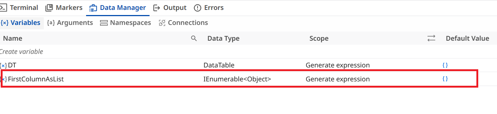

# Autopilot for Developers

These exercises use Autopilot in Studio Desktop to help you build and fix automations faster. Work through each exercise in order — they build on the project you downloaded earlier, in the **2. Autopilot for Developers** folder.

## Exercise 1: Correct Expression

**Ever found yourself stuck while building a test case because of a complex expression and data type?**

Autopilot understands the context of your workflow — including variables, data types, and the expression you're building — and automatically suggests or applies the appropriate correction. Especially useful with unfamiliar or complex object types.

**1.** Open `Correct expression _ rename.xaml` in the **2. Autopilot for Developers** folder.

**2.** Right-click the **Comment Out** activity and select **Enable Activity**.

**3.** Notice validation errors appear in the workflow. Open the Expression Editor for the `To Variable` property, observe the `Files` variable, then close the editor.

**4.** Open the Expression Editor for the `Set Value` property. Notice the validation error in the expression.

**5.** Click the **Fix** button (magic wand) at the top of the Expression Editor.

**6.** Observe the expression is automatically corrected and the validation error resolved.

**7.** Click **Debug / Run**.

---

## Exercise 2: Correct Workflow Errors

**Want to focus on the real work instead of worrying about data types and conversions?**

Use the Autopilot option in the Expression Editor. Autopilot helps you write and transform expressions using natural language.

**1.** Open `Correct WF errors.xaml` in the **2. Autopilot for Developers** folder.

**2.** Observe the first **Assign** activity — both variables are assigned numeric values, so they're of type `Integer`.

**3.** Right-click the **Comment Out** activity and select **Enable Activity**.

**4.** Notice the validation error. Open the Expression Editor for the `Set Value` property and review the expression and error.

**5.** Use the **Autopilot** option at the bottom of the Editor window.

**6.** Add an instruction in natural language — e.g. “Change the result of this expression to String” — then click the Autopilot icon on the right of the box.

**7.** Observe the expression is automatically updated and the validation error resolved.

**8.** Close the editor and click **Debug / Run**.

---

## Exercise 3: Generate Expression

**Why memorize expression syntax when you can simply describe what you need?**

Use the Autopilot option in the Expression Editor. Simply describe what you want in natural language, and Autopilot generates  the expression for you.

**1.** Open `Generate expression.xaml` in the **2. Autopilot for Developers** folder.

**2.** Observe the **Assign** activity, renamed “Get the First Column.”

**3.** Notice the `To Variable` field is already configured with the variable `FirstColumnAsList`, which stores all values from the first column of a `DataTable`.

**4.** Open Data Manager and inspect the data type of `FirstColumnAsList` — it's a complex type, making the required expression hard to write manually.

**5.** Open the Expression Editor for the `Set Value` property.

**6.** Paste the copied instruction into the Autopilot prompt box at the bottom of the editor, then click the Autopilot icon.

**7.** Observe Autopilot replaces the `[Nothing]` expression with a valid one matching the instruction and required output type.

**8.** Close the editor and click **Debug / Run**.

---

## Exercise 4: Generate Low-Code Workflow

This exercise is covered in the [Integration Service](02-integration-service.md) lesson.

---

## Exercise 5: Stopwatch

Similar to the previous exercise — you'll provide a prompt to Autopilot, and it will generate the workflow for you.

**1.** Open `Stopwatch.xaml` from the **2. Autopilot for Developers** folder.

**2.** A sample instruction is provided in the workflow annotation.

**3.** Click the instruction — notice the **Generate** option from Autopilot on the right.

**4.** Click **Generate**.

**5.** Observe Autopilot generate the workflow automatically based on the instruction.

**6.** Review the generated workflow, then click **Debug** or **Run** to verify it executes successfully.

---

## Generic Best Practices for Autopilot Prompt Creation

### Key Guidelines

✅ Ensure that your instructions are clear and unambiguous.

✅ Create instructions that encourage action.

✅ Clearly state your expectations.

✅ Use active voice to enhance the clarity of your instructions.

✅ Define the desired format of the output.

✅ Incorporate relevant keywords to steer Autopilot's response in a specific direction.

✅ Set boundaries and restrictions if necessary.

✅ Test different versions of your instructions and refine as needed.

✅ Pay attention to grammar and punctuation.

### Why is Grammar and Punctuation Important?

Agents do not think like humans—they generate responses based on the input they receive. The better the prompt, the more relevant and accurate the output will be.

✅ Poor prompts lead to vague or incorrect results.

✅ Well-structured prompts improve accuracy, efficiency, and decision-making.

### Prompt Quality Examples

**Bad Prompt:** _"Summarize this."_

**Good Prompt:** _"Summarize the following text in 100 words, highlighting key findings and insights."_

---

**Clarity** – Avoid vague instructions.

_Instead of "Explain this," say "Explain this process step by step."_

**Specificity** – Provide detailed guidance.

_Instead of "Find errors," say "Identify and correct grammar mistakes in this paragraph."_

**Conciseness** – Keep prompts brief but informative.

_Instead of "Can you please check this document for any mistakes, and also suggest any improvements in formatting, word choice, and clarity?" say "Review this document for grammar and clarity issues."_

**Relevance** – Include only the necessary details to avoid confusion.

_Instead of "Rewrite this email in a formal tone while also ensuring it aligns with my company's mission statement and includes industry best practices for customer engagement," say "Rewrite this email in a professional and polite tone."_

**Flexibility** – Design prompts that can be used across different scenarios.

_Instead of "Summarize this news article about AI in 50 words," say "Summarize this text in 50 words, highlighting key points and insights."_

---

[Next → Integration Service](02-integration-service.md){: .md-button .md-button--primary}

---

