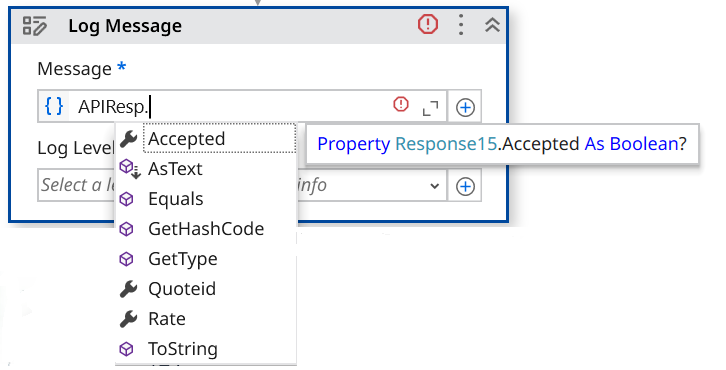

# API Testing

## What is an API?

An **API** (Application Programming Interface) is a computing interface that enables communication and data exchange between two independent software systems. It defines how requests are made, what data formats are used, and what responses to expect.

In simple terms, an API lets software components talk to each other — for example, a weather app might use an API to get data from a weather service.

## What is API testing?

**API testing** verifies that APIs behave as expected. Instead of testing through the UI (clicking buttons, entering text), it interacts directly with the underlying service using requests and examines the responses.

Key aspects tested:

- **Functionality** — does the API do what it's supposed to?
- **Reliability** — is the API available and stable over time?
- **Performance** — how fast does the API respond?
- **Security** — are unauthorized users kept out?

## API testing vs. GUI testing

| Aspect | API Testing | GUI Testing |
|---|---|---|
| Focus | Business logic layer | User interface |
| Input/Output | Structured data (JSON/XML) via software | User actions (keyboard, mouse) |
| Speed | Faster | Slower |
| Maintenance | Easier | More fragile |

## API testing approach

A predefined strategy the QA team follows to conduct API testing once the build is ready:

To effectively test APIs, follow this approach:

1. **Understand the API's functionality** — read the documentation, identify endpoints, methods (GET, POST, etc.), input parameters, and expected responses.
2. **Design test cases** — using techniques such as Equivalence Partitioning, Boundary Value Analysis, and Error Guessing.
3. **Set input parameters** — define what data each API request needs.
4. **Execute and validate** — run the test cases, compare actual vs. expected responses, log and retest issues.

## API testing in UiPath

API automation testing requires an application that can be interacted with via an API. Ways to interact with an API in UiPath:

- **HTTP Activities** — use the HTTP Request activity to send requests directly.
- **Import API Definition (Swagger/OpenAPI)** — bring structured API definitions into UiPath Studio.
- **Import Postman Collection** — use existing Postman test collections within Studio.
- **Integration Service** — use UiPath's pre-built connectors to work with SaaS platforms.

## What is Postman?

Postman is a collaboration platform for API development — its features simplify each step of building an API and streamline collaboration.

let's watch API Testing using UiPath

<video width="100%" controls style="border-radius: 6px; box-shadow: 0 2px 8px rgba(0, 0, 0, 0.12), 0 4px 12px rgba(0, 0, 0, 0.08); margin: 20px 0;">
  <source src="../../assets/videos/API-testing.mp4" type="video/mp4">
  Your browser does not support the video tag.
</video>

---

## Exercise 1: API Testing Using HTTP Activities

**Create an API test case that sends HTTP requests and validates response.**

In this exercise, you will create an API test case for the UiBank application. Using the UiBank API, you will automate the testing of the loan application functionality by sending HTTP requests and validating the responses returned by the service.

### Explore the UiBank API home page

**1.** Navigate to the <a href="https://uibank-api.uipath.com" target="_blank">UiBank API</a> website.

**2.** The UiBank API home page provides links to:

✅ **Explore API** — interactive API documentation.

✅ **Swagger File** — the OpenAPI/Swagger definition that can be imported into UiPath Studio.

**3.** **Explore the available API endpoints and their specifications**

Go to **Explore API → Quote** to view the available loan quote endpoints, then open the `/quote/newquote` endpoint and click **Try it Out!**

**4.** Copy the endpoint: `https://uibank-api.uipath.com/api/quotes/newquote`

**5.** Explore the response — there are three fields: `accepted`, `rate`, and `quoteid`.

### Build the test case

**Step 1.  Create a new Test Case** 

✅ Right-click the **APIs** folder in the ILT project

✅ select **Add → Test Case** from the context menu.

**Step 2.  Enter the test case details** 

✅ In the **Name** field, enter a name for the test case.

✅ Leave the **Location** field unchanged.

✅ From the **Based On** dropdown, select **Empty Test Case Template**.

✅ Ensure **Execution Template** is set to `<no execution template>`.

✅ Click **Next** to proceed to the **Test Data** configuration step. To add test data, from **Source** select **file**, browse to the **API** subfolder in the project, and select the file `APITestData.xlsx`.

✅ Click **Create** to create the test case.

**3.  HTTP Request activity**

✅ In the Activities panel, search for the `HTTP Request` activity. 

✅ Drag and drop the activity onto the Designer canvas.

**4. Configure Activity** 

Configure the HTTP Request activity using the values from the UiBank API documentation:

✅ Change **Request method** to **Post**.

✅ Add the **Request URL** copied earlier.

✅ Expand the **Parameters** section and add the parameter names (keys) as defined in the UiBank API documentation. For each parameter, map the corresponding test case argument as the value — the required arguments are already configured as part of this data-driven test case.

✅ Set **Request body type** to **none**.

✅ Create a variable in the output property **Response content**. Example: `APIResp`.

!!! tip
    Create variables directly from the Properties panel instead of using the Data Manager. When a variable is created from the Properties panel, UiPath automatically assigns the appropriate data type based on the property being configured — eliminating the need to manually search for and select the correct data type from the Data Manager.

**5.** Deserialize the API response. The response (`APIResp`) is returned as an `HTTPResponseSummary` object.

✅ Add a **Deserialize JSON** activity.

✅ Set its input to `APIResp.TextContent`. This converts the JSON response payload into a format that can be used for validations and assertions.

✅ Create a variable in the Properties panel for capturing the output. Example: `JSONObj`.

**6.** Verify the result — you'll test whether the `accepted` parameter of the API response is `true` or `false`.

✅ Add a **Verify Expression With Operator** activity.

✅ In **First Expression**, add `JSONObj("accepted").ToString`.

✅ In **Second Expression**, add the argument `Accepted`.

**7.** Execute this data-driven test case from the Test Explorer.

---

## Exercise 2: Create an API Test Using an Imported OpenAPI Definition

In this exercise, you will import an OpenAPI (Swagger) definition into UiPath Studio and use the generated API activities to create an automated test for the UiBank loan quote API.

**Step 1.  Import the API definition**  

✅ From the top ribbon in UiPath Studio, click **New Service**.

**Step 2.  Swagger URL** 

✅ Add the Swagger URL in the link field and load. 

✅ Observe the namespace `uibankapi` created, then close the wizard.

!!! note
    You can check/uncheck to choose the APIs you want to import.

**Step 3.  UiBank Activity** 

✅ From the Activities panel, search for `uibank`. 

✅ All the picked endpoints are now available as activities — this makes them convenient to configure. 

✅ Locate the generated activity `Quote_newquote`.

**Step 4.  New Test Case**
✅ Create a new test case in the APIs folder by following the steps from the previous exercise

✅ Add `APITestData.xlsx` as the test data source.

✅ Drag the activity into the test case.

✅ Configure the required input parameters.

!!! note
    The API parameters expect values of type `Double`, while the test case arguments are provided as `String` values. Use the `CDbl()` method to convert the string arguments before mapping them to the API parameters.

    Create a variable within the activity by using **Ctrl+K**. 
    
    The response variable is of type `Response15`, which provides strongly typed access to the API response fields, including `Accepted`, `Rate`, and `QuoteID`. These properties can be referenced directly in verification activities without additional deserialization.

**Step 5.  Output** 

✅ Observe the output of the activity by adding a **Log Message** activity.

**Step 6. Verify** 

✅ Add a **Verify Expression with Operator** activity to validate the API response.

!!! note
    The `Trim` function removes leading and trailing spaces from the text.

**Execute this data-driven test case from the Test Explorer.**

---

## Optional Exercise: API Testing Using Integration Service

Create a data-driven test case to validate the UiBank API's Create Loan functionality. Use the two test records provided in `APITestData.xlsx`, execute the API request for each record, and verify that the returned results match the expected values.

**1.** Search for the **Insert Record** activity in Studio, choosing the API connection created in the previous exercise.

**2.** Select object: `QuotesNewquote`.

**3.** Transform (`CInt`) the properties to integers.

**4.** Verify that the `accepted` property from the API response matches what's expected.

**5.** Log the quote rate.

**6.** Check the parameters specified in the API explorer.

---

[Next → Coded Test Cases](04-coded-test-cases.md){: .md-button .md-button--primary}

---

