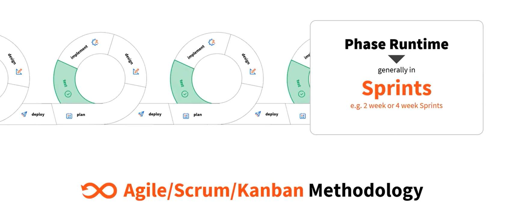

# Introduction to Software Testing Concepts

## What is testing?

**Testing** is an investigation conducted to provide stakeholders with information about the quality of the product or service under test.

## Why do we test?

Rigorous testing turns an uncertain piece of software into a predictable asset. By uncovering functional bugs, performance bottlenecks, security vulnerabilities, and usability hiccups before release, testing prevents the spiraling costs and reputational damage that accompany production failures.

## Stages of testing

Each stage of the software testing life cycle enables you to judge specific product qualities and confirm readiness. Systematic evaluations expose defects and weaknesses before the application reaches production and deployment. Addressing issues early protects your reputation and maintains customers' confidence in the solutions you deliver.

Catching issues early is also exponentially cheaper than issuing hot-fixes after customers experience crashes or data leaks.

## A bit about software methodologies

### Waterfall

Invented in 1970, the waterfall methodology was revolutionary because it brought discipline to software development to ensure there was a clear path to follow. It was based on the waterfall manufacturing method derived from Henry Ford's 1913 assembly line innovations, which provided certainty as to each step in the production process to guarantee that the final product matched what was specified in the first place.

The waterfall methodology is all about structure and moving from one phase to the next, so breaking your project into milestones is key to any waterfall plan.

When the waterfall methodology came to the software world, computing systems and their applications were typically complex and monolithic, requiring discipline and a clear outcome to deliver. Requirements also changed slowly compared to today, so large-scale efforts were less problematic — in fact, systems were built under the assumption they would not change.

In the traditional Waterfall model, each phase — from planning to deployment — runs sequentially and often lasts weeks or even months.

### Moving forward

The waterfall model's linear, rigid approach, which required each stage to be completed before moving to the next, often resulted in inefficiencies, delayed feedback, and less adaptability to change. Agile methodology evolved as a solution, promoting flexibility, frequent customer interaction, and iterative development — improving software quality and ensuring project relevance.

### Introducing Agile

The Agile Manifesto's guiding principles champion delivering valuable software early and often, embracing change at any stage, and measuring progress through working code. Agile relies on tight collaboration — especially face-to-face — between motivated, self-organizing teams and business stakeholders, trusting individuals to act responsibly. It emphasizes a sustainable, steady pace, continuous focus on technical excellence and good design, and a commitment to simplicity by avoiding unnecessary work. Finally, teams regularly pause to reflect and adjust, continually improving their effectiveness.

Each sprint drives a full cycle: plan, design, implement, test, and deploy.

## Types of testing

✅ **Unit Testing** — individual units of a system are tested. The purpose is to validate that each unit of the system code performs as expected.

✅ **Integration Testing** — individual units are combined and tested as a group. The purpose of this level of testing is to expose faults in the interaction between integrated units.

✅ **System or End-to-End Testing** — validates the complete and fully integrated system. The purpose of a system test is to evaluate the end-to-end system specifications.

✅ **Acceptance Testing** — evaluates the system's compliance with the business requirements and assesses whether it is acceptable for delivery.

!!! info "Testing frequency and effort distribution"
    **Exploratory testing** focuses on discovery and relies on the guidance of the individual tester to uncover defects that are not easily covered in the scope of other tests.

    UiPath Test Cloud brings the most value in the middle of the pyramid: **End To End** and **Integration** testing.

    **Unit Tests** are created and executed by the developers.

---

[Next → ALM Tools Integration](02-alm-tools-integration.md){: .md-button .md-button--primary}

---
