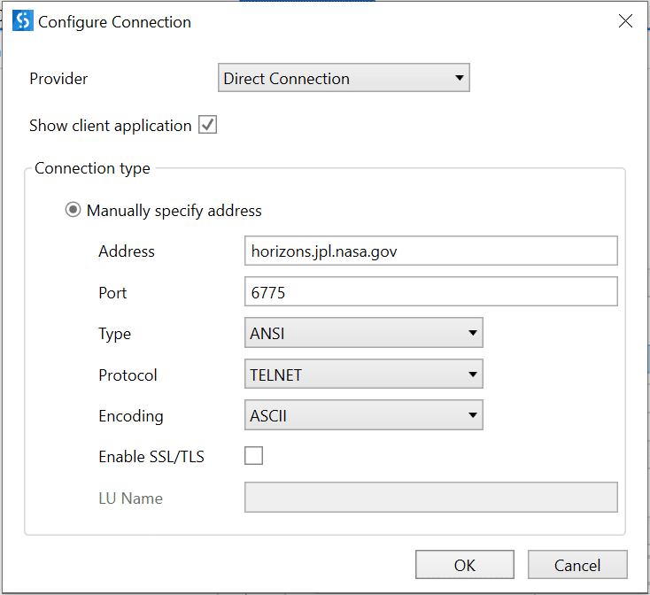
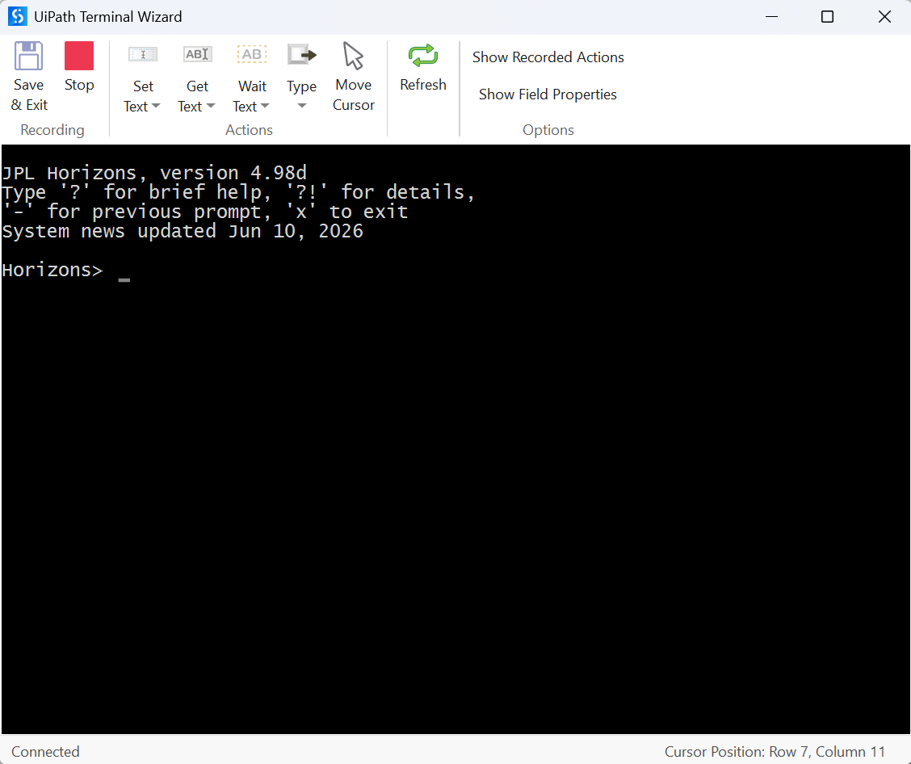

# Terminal Testing

## What is a terminal?

Terminals — also known as command lines or consoles — let you accomplish and automate tasks on a computer without a graphical user interface. Sending simple text commands to navigate a directory or copy a file forms the basis for many more complex automations and programming skills.

## What is a mainframe computer?

A mainframe computer is used primarily by large organizations for critical applications, bulk data processing (census, industry/consumer statistics, ERP, large-scale transaction processing), and similar workloads. Mainframes are larger and more powerful than minicomputers, servers, workstations, and personal computers. Most large-scale computer-system architectures were established in the 1960s and continue to evolve — mainframes are used as (super)servers.

## Setup

Since users typically access terminal-based applications through a terminal emulator, it makes sense to test them the same way. UiPath supports terminal emulation through the `UiPath.Terminal.Activities` package.

The Terminal pack contains activities to connect to a terminal and work within it efficiently — retrieve text, fields, or screen positions, send keys or text, or wait for certain text/fields to appear as triggers.

The **Terminal Session** activity connects to the host system, or via a third-party terminal emulator such as Attachmate Reflection, Attachmate Extra, Rocket BlueZone, IBM Personal Communications, or Reflection for UNIX/IBM.

## Recovery

Recovering from unexpected errors is one of the challenges of testing terminal-based applications. Because of their stateful nature, several actions may be needed to return the application to its "base state" where each test starts and stops. The solution: build a recovery step executed at the end of each test that identifies the current screen and calls its "Dismiss" action. Typing `F3` or `F12` may suffice for most screens; others may need a series of actions, or completing the current transaction. Either way, the recovery mechanism ensures the target application is at a known starting state before each test begins.

!!! example "Exercise: Terminal Testing"
    Create a test case that verifies the density of the Moon is greater than 3, using the [NASA Horizons System CLI](https://ssd.jpl.nasa.gov/?horizons){target=_blank} (no account or password required). Explore what commands are needed — and don't forget to install Terminal Activities.

    ### Step 1 — Test case
    Create a new test case.

    ### Step 2 — Activity package
    Install Terminal Activities.

    ### Step 3 — Terminal activity
    Go to the activity panel and search for Terminal activities.

    ### Step 4 — Terminal Session
    Drag and drop the **Terminal Session** activity into the designer, using the configuration shown in the source course.

    

    ### Step 5 — Record
    Click OK — the Recorder wizard opens. Perform the required actions, then save and exit; the recorded actions are automatically converted into workflow activities and added to your test case. Alternatively, build the test case by dragging and dropping the required activities.

    ### Step 6 — Send "Moon"
    Click **Type**, select **Type** from the dropdown, add `Moon` to the text box, and click OK.

    ### Step 7 — Transmit
    Click **Type**, select **Send Control Key**, keep **Transmit** as the Control Key option (default), and click OK.

    

    ### Step 8 — Density data
    The Horizons System returns two matching options: `3` and `301`. Since we want the Moon's physical properties (including density), use `301` — repeat the Type/Transmit steps to send it.

    ### Step 9 — Extract data
    Observe the response — density data is available. Click **Get Text**, then **Get Text at Position**, and use these parameters: Row `8`, Column `2`, Length `36`.

    ### Step 10 — Test the test case
    Save and exit. Create a variable to hold the output from Get Text at Position, and add a log message to confirm the actions execute.

    ### Step 11 — Add verification
    Use **Verify Expression With Operator** to verify the output. The output is stored as a string — extract the numeric value and convert it to a numeric data type before comparing it to 3. Use Autopilot to generate the required expression.

---

[← Testing Framework](02-testing-framework.md) · [Next: Best Practices →](04-best-practices.md)
